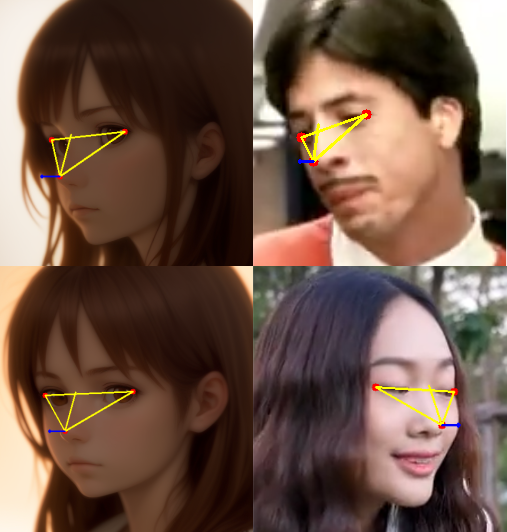

# 頭部姿勢推定を簡易実装する

## はじめに

頭部姿勢推定は、顔の向きや角度を計算する技術です。
この記事では、**複雑なパラメーターを使用せず**、簡易的な方法を用いて頭部姿勢を推定する方法を紹介します。具体的には、顔のランドマークを利用して三角形をつくり、その重心から顔の向きを2D平面上で推定します。

通常、頭部姿勢推定にはカメラの
- 内部パラメーター
- 外部パラメーター

が必要となります。内部パラメーターは、カメラの焦点距離や画像の中心点などを表すパラメーターで、カメラごとに異なります。外部パラメーターは、カメラの位置や向きを表すパラメーターで、カメラの位置や向きが変わると変化します。

これらのパラメーターを用いて、以下のような図が得られます。

- [opencv/Pose Estimation](https://docs.opencv.org/4.x/d7/d53/tutorial_py_pose.html)

あるいは[こちらのリポジトリ](https://github.com/yinguobing/head-pose-estimation)では、深層学習を用いて頭部姿勢を推定する方法も紹介されています。

しかしながら実際は、これらのパラメーターを正確に求めようとすると大変です。また、深層学習を用いた方法は、計算量が多くなってしまいます。

この記事では、これらの複雑なパラメーターを使用せず、簡易的な方法を用いて頭部姿勢を推定する方法を紹介します。
顔のランドマークを利用して三角形をつくり、その重心から顔の向きを2D平面上で推定します。

## アルゴリズム
1. **両目を結ぶ直線の分析**
   - この直線が水平に近い場合、顔は正面を向いている可能性が高い。
   - この直線が傾いている場合、顔が左右に傾いている可能性がある。この傾きの度合いは、顔の傾きの度合いを示す。

2. **左目、右目、鼻の頂点を結ぶ三角形の分析**
   - 三角形の形状や大きさを分析することで、顔の向きを推定。
   - 三角形の重心と鼻の頂点の位置関係を分析することで、顔の左右の向きを推定。

3. **鼻筋の直線の分析**
   - この直線の長さや位置を分析することで、顔が上下に傾いているかを推定。
   - 鼻筋の直線が三角形の底辺の中央を通る場合、顔は正面を向いていると推定。
   - 鼻筋の直線が三角形の底辺の左側を通る場合、顔は左に向いていると推定。
   - 鼻筋の直線が三角形の底辺の右側を通る場合、顔は右に向いていると推定。

## 実装
